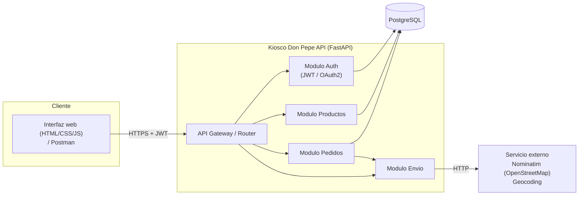

# Kiosco Don Pepe API

API REST desacoplada para la modernizacion del sistema **Kiosco Don Pepe**, desarrollada como
resolucion del caso de estudio de las Olimpiadas Institucionales de Programacion (E.E.S.T. N°6
"Chacabuco" — 7° año). Reemplaza el monolito original en ASP.NET MVC por una arquitectura de
servicios con autenticacion centralizada, integracion externa, testing automatizado, pipeline
CI/CD y despliegue en contenedores.

## 1. Arquitectura del sistema



- **Interfaz web** (`app/static/`): cliente en HTML, CSS y JavaScript sin dependencias externas,
  servido en `http://localhost:8000/`. Consume la API igual que cualquier otro cliente, enviando el JWT
  en cada request.
- **API Gateway / Router**: unico punto de entrada (`app/main.py`), monta los modulos y aplica CORS.
- **Auth**: registro/login con JWT (OAuth2 Password Flow), passwords hasheados con bcrypt.
- **Productos**: catalogo del kiosco (CRUD, escritura restringida a rol `admin`).
- **Pedidos**: carrito/ticket de compra, descuenta stock y calcula costo de envio.
- **Envio**: integra el servicio externo de mapas (Nominatim/OpenStreetMap) para geocodificar
  direcciones y calcular distancia (formula de Haversine) y costo de envio.
- **PostgreSQL**: persistencia relacional via SQLAlchemy ORM.

## 2. Modelo de datos

- `Usuario` (id, nombre, email, hashed_password, rol: cliente/admin)
- `Producto` (id, nombre, descripcion, precio, stock)
- `Pedido` (id, usuario_id, fecha, estado, direccion_envio, costo_envio, total)
- `DetallePedido` (id, pedido_id, producto_id, cantidad, precio_unitario)
- `Preferencias` (usuario_id, tema: claro/oscuro, paleta: colores en JSON) — una fila por usuario

## 3. Endpoints principales

| Metodo | Endpoint | Auth | Descripcion |
|---|---|---|---|
| POST | `/api/v1/auth/register` | Publico | Crea un usuario (rol cliente) |
| POST | `/api/v1/auth/login` | Publico | Devuelve un JWT (`access_token`) |
| GET | `/api/v1/auth/me` | JWT | Datos del usuario autenticado |
| GET | `/api/v1/productos` | Publico | Lista el catalogo |
| GET | `/api/v1/productos/{id}` | Publico | Detalle de un producto |
| POST | `/api/v1/productos` | JWT admin | Crea un producto |
| PUT | `/api/v1/productos/{id}` | JWT admin | Actualiza un producto |
| DELETE | `/api/v1/productos/{id}` | JWT admin | Elimina un producto (409 si tiene pedidos asociados) |
| POST | `/api/v1/pedidos` | JWT | Crea un pedido (descuenta stock, cotiza envio) |
| GET | `/api/v1/pedidos/me` | JWT | Pedidos del usuario autenticado |
| GET | `/api/v1/pedidos` | JWT admin | Lista todos los pedidos |
| GET | `/api/v1/pedidos/{id}` | JWT (dueño o admin) | Detalle de un pedido |
| PATCH | `/api/v1/pedidos/{id}/estado` | JWT admin | Cambia el estado del pedido |
| POST | `/api/v1/envio/cotizar` | JWT | Cotiza distancia/costo de envio a una direccion |
| GET | `/api/v1/preferencias` | JWT | Apariencia guardada del usuario (tema y paleta) |
| PATCH | `/api/v1/preferencias` | JWT (paleta: solo admin) | Cambia el tema y/o la paleta de colores del usuario |
| GET | `/health` | Publico | Health check |

Documentacion interactiva autogenerada (Swagger UI): `http://localhost:8000/docs`.

### Interfaz web

Disponible en `http://localhost:8000/`:

- **Clientes**: registro e inicio de sesion, catalogo con busqueda y orden, carrito (se guarda en el
  navegador), cotizacion del envio con el servicio de mapas, confirmacion del pedido y seguimiento
  del estado en "Mis pedidos".
- **Administradores**: estadisticas (pedidos, pendientes, facturado, productos sin stock), cambio
  de estado de los pedidos, alta, edicion y baja de productos, y personalizacion de la paleta de
  colores en "Apariencia" (paletas rapidas o colores a eleccion, con vista previa).
- **Modo claro / oscuro** para todos (boton 🌙 / ☀️ de la barra superior). Se guarda en el navegador
  y, con sesion iniciada, tambien en la cuenta.
- **La paleta de colores es por cuenta**: se guarda en la tabla `preferencias` asociada al usuario,
  asi que cada administrador ve sus propios colores y no cambia los de los demas.
- Todos los formularios validan los datos antes de enviarlos y muestran mensajes de error claros.

## 4. Testing automatizado

- **Unitarios**: `tests/test_security.py` (JWT, hashing), `tests/test_geocoding.py`
  (geocoding y calculo de distancia, con el servicio externo mockeado via `respx`).
- **Integracion**: `tests/test_auth_api.py`, `tests/test_productos_api.py`,
  `tests/test_pedidos_api.py`, `tests/test_envio_api.py` — usan `TestClient` de FastAPI contra
  una base SQLite en memoria.

Ejecutar localmente:

```bash
pip install -r requirements-dev.txt
pytest
```

Esto genera un reporte de cobertura en consola y un `coverage.xml`.

## 5. Pipeline de CI/CD

Definido en [`.github/workflows/ci-cd.yml`](.github/workflows/ci-cd.yml):

1. **Lint** con `ruff`.
2. **Tests** con `pytest` (+ reporte de cobertura como artifact).
3. **Build y push de la imagen Docker** a GitHub Container Registry (`ghcr.io`) cuando se hace
   push a `main` (solo si el job de tests fue exitoso).

## 6. Despliegue con Docker

### Requisitos
- Docker y Docker Compose instalados.

### Pasos

```bash
cp .env.example .env
# editar .env si hace falta (JWT_SECRET_KEY, direccion del kiosco, etc.)

docker compose up --build
```

Esto levanta:
- `db`: PostgreSQL 16, expuesto en el puerto `5433` de la PC (para no chocar con un PostgreSQL local en el `5432`).
- `api`: la API FastAPI en `http://localhost:8000` (crea las tablas automaticamente al arrancar).

Cargar datos de ejemplo (usuario admin + productos):

```bash
docker compose exec api python -m scripts.seed
```

Credenciales de ejemplo: `admin@kiosco.com` / `admin123`.

### Despliegue sin Docker (PostgreSQL local, Windows)

Requisitos: **Python 3.12** (las versiones fijadas en `requirements.txt` no tienen paquetes
compilados para Python 3.13+) y **PostgreSQL** instalado y corriendo.

1. Crear el usuario y la base de datos (pide la clave del superusuario `postgres`):

   ```powershell
   $psql = "C:\Program Files\PostgreSQL\18\bin\psql.exe"   # ajustar a la version instalada
   & $psql -U postgres -c "CREATE ROLE kiosco WITH LOGIN PASSWORD 'kiosco';"
   & $psql -U postgres -c "CREATE DATABASE kiosco_don_pepe OWNER kiosco ENCODING 'UTF8';"
   & $psql -U postgres -c "ALTER DATABASE kiosco_don_pepe SET lc_messages TO 'C';"
   ```

   El ultimo comando hace que PostgreSQL devuelva los errores en ingles: con un PostgreSQL en
   español, `psycopg2` falla con `UnicodeDecodeError` al intentar leer los mensajes con tildes.

2. Crear el entorno virtual e instalar dependencias:

   ```powershell
   py -3.12 -m venv .venv
   .\.venv\Scripts\python.exe -m pip install -r requirements-dev.txt
   ```

3. Configurar las variables: copiar `.env.example` como `.env` y cambiar `JWT_SECRET_KEY` por
   una clave propia. La aplicacion lee el `.env` automaticamente al iniciar.

   ```powershell
   Copy-Item .env.example .env
   ```

4. Cargar los datos de ejemplo e iniciar el servidor:

   ```powershell
   .\.venv\Scripts\python.exe -m scripts.seed
   .\.venv\Scripts\python.exe -m uvicorn app.main:app --reload --port 8000
   ```

La API queda en `http://localhost:8000` y la documentacion en `http://localhost:8000/docs`.
En Linux/macOS los pasos son los mismos usando `.venv/bin/python`.

## 7. Origen del proyecto

Este proyecto retoma el dominio del sistema **Kiosco Don Pepe** (ASP.NET MVC monolitico,
`https://github.com/rodriyjaz1988-hue/Kiosco_Don_Pepe`) y lo reconstruye como una API REST
desacoplada para cumplir con los requisitos de arquitectura avanzada, integracion de sistemas,
testing automatizado y DevOps del caso de estudio.
